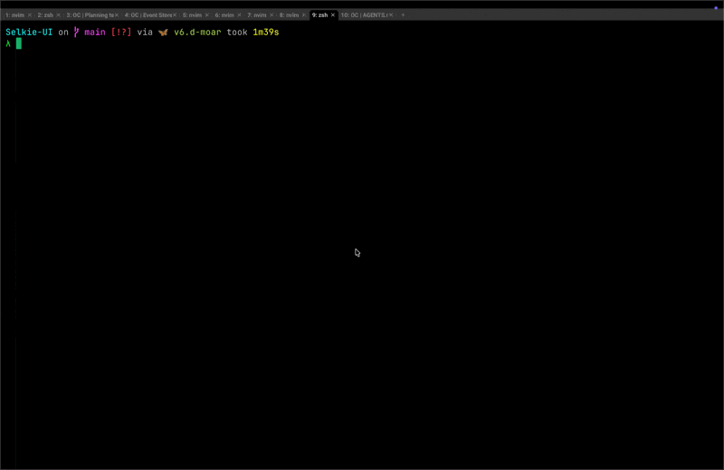
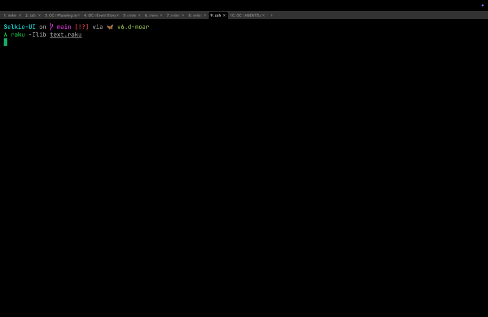
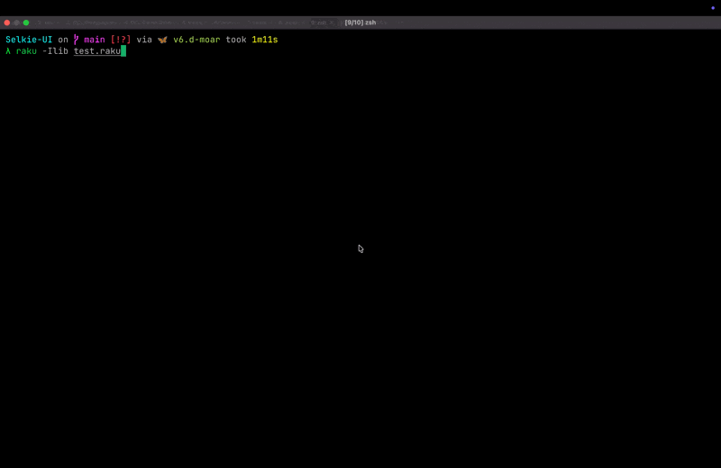

[](https://github.com/FCO/Selkie-UI/actions)

NAME
====

Selkie::UI

TITLE
=====

UI Builder Abstractions for Selkie

NOTE
====

This module is under active development. API may change.

SYNOPSIS
========


```raku
use Selkie::UI;

App {
    Screen :name<main>, {
        VBox {
            Button.label: "Click me"
        }
    }
}
```

DESCRIPTION
===========


Selkie::UI provides a Raku-native DSL for building terminal user interfaces using the [Selkie](https://raku.land/zef:apogee/Selkie) framework. Unlike traditional imperative UI code where you manually manage rendering and event loops, this module offers a declarative approach — your code describes **what** the UI should look like and do, not **how** to achieve it step-by-step.

Widgets are declared hierarchically using block syntax, with properties and handlers specified via chained method calls. This makes UI definitions intuitive, compositional, and easy to reason about — whether you are building simple tools or complex applications.

The DSL handles the glue between your declarative definitions and Selkie's imperative runtime, including state management with automatic UI updates when reactive variables change.

State Management
================

`new-state` creates reactive state variables that automatically dispatch updates and re-render affected UI elements.

For compound values (arrays, hashes), assign a new value to trigger updates. In-place mutations do not dispatch.

```raku
my $items := new-state [];
$items = [ |$items, 'new' ];
```

Block-Based Setters
===================

Many builder methods accept a block instead of a value. The block is evaluated once and the builder auto-subscribes to any state read inside it, re-running the setter when those states change. These reactive setters require an active `App` because auto-subscribe uses `$*UI-APP` and the store.

Builders
========

The module exports builder functions for Selkie primitives. Each builder returns a chainable builder object that wraps the underlying widget.

Layout and Containers
---------------------

  * `App` — Application entry point that initializes the UI and starts the event loop

  * `Screen` — Named screens that can be switched between

  * `VBox`, `HBox`, `Split` — Layout containers for stacking or splitting widgets

  * `Border`, `Modal`, `ScrollView` — Container and decorator widgets

  * `CardList` — Scrollable list of variable-height widgets

Inputs and Selection
--------------------

  * `Button` — Clickable button with label and press handler

  * `TextInput`, `MultiLineInput` — Text input fields with submit handling

  * `Checkbox`, `RadioGroup`, `Select` — Selection controls

  * `ProgressBar` — Progress indicator

Text and Lists
--------------

  * `Text`, `TextStream`, `RichText` — Text display widgets

  * `ListView`, `Table`, `TabBar` — List and table widgets

  * `Image`, `Spinner`, `Toast` — Media and status widgets

Overlays and Helpers
--------------------

  * `ConfirmModal` — Confirmation modal builder

  * `CommandPalette` — Fuzzy command launcher

  * `FileBrowser` — File picker modal

  * `HelpOverlay` — Contextual keybind help

  * `PasswordStrength` — Password strength meter

Charts
------

  * `Plot`, `BarChart`, `LineChart`, `ScatterPlot` — Chart widgets

  * `Sparkline`, `Heatmap`, `Histogram` — Inline and grid charts

  * `Axis`, `Legend` — Chart adornments

Helpers
=======

App helpers that interact with the runtime:

  * `OnKey` — Register global key handlers

  * `OnFrame` — Register a per-frame callback

  * `Dispatch` — Dispatch events to the store

  * `Tick` — Tick the store immediately

  * `Quit` — Quit the application

  * `Toast` — Show a transient toast message

Playground
==========

There is a built-in playground to live-edit/test Selkie::UI code:

    raku -I lib bin/selkie-ui-playground.raku

[](./playground.gif)

Examples
========

Text input with reactive display
--------------------------------

This example creates a text input field that echoes user input to a text stream above it.

The program creates a reactive string variable with `new-state`, places a vertical box layout on screen, adds a text stream widget to display messages, and adds a text input widget. When the user types and presses Enter, the input text is stored in the reactive variable, which automatically updates the text stream, and the input field is cleared for the next entry.

```raku
use Selkie::UI;

App {
    my $next-msg := new-state Str;
    VBox {
        TextStream.append: { $next-msg };
        TextInput(:placeholder('Type here...')).size(1).on-submit: -> $input, $text {
            $next-msg = $text;
            $input.clear
        }
    }
}
```

The `App` block is the entry point that initializes the application. The `new-state` function creates a reactive state variable bound with `:=`, initialized as an empty string. The `VBox` widget arranges its children vertically from top to bottom. `TextStream.append` with a block argument reactively displays the value of `$next-msg` and updates whenever it changes. `TextInput` creates a single-line text input with a placeholder hint. `.size(1)` constrains the input to a fixed height of one row. `.on-submit` registers a handler that runs when the user presses Enter. The handler receives the input widget and the submitted text, stores the text in the reactive variable, and clears the input for the next entry.

[](./text.gif)

Button with reactive state
--------------------------

This example shows a button whose label changes based on a numeric state variable.

The program creates a reactive integer counter, places it in a vertical box, and displays a button. The button label is computed from the counter value using a block — when the counter changes, the label automatically re-renders. Each button press increments the counter, updating both the counter value and the button label.

```raku
use Selkie::UI;

App {
    my UInt $val := new-state 0;
    VBox {
        Button.label({ $val ?? "BLE $val" !! "BLA $val" })
            .on-press: { ++$val }
    }
}
```

The `App` block is the entry point that initializes the application. The `new-state` function creates a reactive state variable bound with `:=`, initialized as zero. The `VBox` widget arranges its children vertically. `Button.label` with a block argument computes the label text. The ternary operator shows "BLA 0" when the value is zero, otherwise "BLE $val". `.on-press` registers a handler that runs when the user clicks the button. The handler increments the counter with `++$val`, triggering a UI update.

[](./test.gif)

ListView with reactive items
----------------------------

This example binds a list view to a reactive array. When the array changes, the list updates automatically.

```raku
use Selkie::UI;

App {
    my $items := new-state <One Two Three>;
    VBox {
        ListView.set-items: { $items };
        Button.label('Refresh').on-press: {
            $items = <One Two Three Four>
        }
    }
}
```

EXPORTS
=======

App and Screen
--------------

App(&block, |c)
---------------

Application entry point that initializes the UI and starts the event loop.

Screen(&block, Str :$name = "main", |c)
---------------------------------------

Named screens that can be switched between.

Layout Containers
-----------------

VBox(&block, :$size, :$style, |c)
---------------------------------

Vertical box layout. Stacks children top-to-bottom.

HBox(&block, :$size, :$style, |c)
---------------------------------

Horizontal box layout. Stacks children left-to-right.

Split(&block, :$size, :$style, |c)
----------------------------------

Split container. Divides space between children.

Inputs and Selection
--------------------

Button(:$label, :$size, :$style, |c)
------------------------------------

Pressable button with label. Supports `.on-press` handler.

TextInput(:$placeholder, :$size, :$style, |c)
---------------------------------------------

Single-line text input field. Supports `.value` for current text.

MultiLineInput(:$placeholder, :$max-lines, :$size, :$style, |c)
---------------------------------------------------------------

Multi-line text input area.

Checkbox(:$label, :$size, :$style, |c)
--------------------------------------

Toggleable checkbox with label.

RadioGroup(:$size, :$style, |c)
-------------------------------

Group of radio buttons for exclusive selection.

Select(:$size, :$style, |c)
---------------------------

Dropdown-style selection widget.

PasswordStrength(:$input!, :$show-label, :$size, :$style, |c)
-------------------------------------------------------------

Password input with strength meter visualization.

Text and Rich Content
---------------------

Text(:$text, :$size, :$style, |c)
---------------------------------

Static text display widget.

TextStream(:$placeholder, :$size, :$style, |c)
----------------------------------------------

Scrollable text stream. Supports `.append` for streaming content.

RichText(:$truncated-top, :$truncated-bottom, :$size, :$style, |c)
------------------------------------------------------------------

Rich text widget with styled content.

Lists and Tables
----------------

ListView(:$size, :$style, |c)
-----------------------------

Scrollable list of items. Supports `.items` for reactive data.

Table(:$show-scrollbar, :$size, :$style, |c)
--------------------------------------------

Tabular data display with column headers.

CardList(&block, :$size, :$style, |c)
-------------------------------------

Scrollable list of variable-height widget cards.

TabBar(:$size, :$style, |c)
---------------------------

Tabbed navigation bar.

Overlays and Helpers
--------------------

Border(&block, :$title, :$hide-top-border, :$hide-bottom-border, :$size, :$style, |c)
-------------------------------------------------------------------------------------

Bordered container with optional title.

Modal(:$width-ratio, :$height-ratio, :$dim-background, :$size, :$style, |c)
---------------------------------------------------------------------------

Modal overlay dialog.

ConfirmModal(:$size, :$style, |c)
---------------------------------

Confirmation dialog with accept/cancel buttons.

Toast(Str $message, Numeric :$duration = 3e0)
---------------------------------------------

Temporary toast notification.

HelpOverlay(:$app!, :$focused-widget, :$size, :$style, |c)
----------------------------------------------------------

Keyboard shortcut help overlay.

CommandPalette(:$size, :$style, |c)
-----------------------------------

Command palette for fuzzy-searchable actions.

FileBrowser(:$size, :$style, |c)
--------------------------------

File system browser widget.

Miscellaneous
-------------

ScrollView(:$show-scrollbar, :$size, :$style, |c)
-------------------------------------------------

Scrollable viewport container.

Spinner(:@frames, :$interval, :$style, :$size, |c)
--------------------------------------------------

Animated spinner with configurable frames and interval.

Image(:$file, :$size, :$style, |c)
----------------------------------

Image display widget.

ProgressBar(:$size, :$style, |c)
--------------------------------

Progress bar with configurable value.

Charts
------

Plot(:$type, :$min-y, :$max-y, :$title, :$gridtype, :$rangex, :@store-path, :$empty-message, :$size, :$style, |c)
-----------------------------------------------------------------------------------------------------------------

General-purpose plot widget.

BarChart(:@data, :@store-path, :$orientation, :$palette, :$show-axis, :$show-labels, :$min, :$max, :$tick-count, :$empty-message, :$size, :$style, |c)
------------------------------------------------------------------------------------------------------------------------------------------------------

Bar chart with configurable orientation and styling.

LineChart(:@series, :&store-path-fn, :$palette, :$show-axis, :$show-legend, :$fill-below, :$overlap, :$y-min, :$y-max, :$tick-count, :$empty-message, :$size, :$style, |c)
--------------------------------------------------------------------------------------------------------------------------------------------------------------------------

Line chart with multiple series support.

ScatterPlot(:@series, :@store-path, :$palette, :$x-min, :$x-max, :$y-min, :$y-max, :$overlap, :$empty-message, :$size, :$style, |c)
-----------------------------------------------------------------------------------------------------------------------------------

Scatter plot for point data visualization.

Sparkline(:@data, :@store-path, :$min, :$max, :$empty-message, :$size, :$style, |c)
-----------------------------------------------------------------------------------

Compact inline sparkline chart.

Heatmap(:@data, :@store-path, :$ramp, :$min, :$max, :$empty-message, :$size, :$style, |c)
-----------------------------------------------------------------------------------------

Heatmap for matrix data visualization.

Histogram(:@values, :$bins, :@bin-edges, :$orientation, :$palette, :$show-axis, :$show-labels, :$min, :$max, :$tick-count, :$empty-message, :$size, :$style, |c)
----------------------------------------------------------------------------------------------------------------------------------------------------------------

Histogram for distribution visualization.

Axis(:$min!, :$max!, :$edge, :$tick-count, :$show-line, :$size, :$style, |c)
----------------------------------------------------------------------------

Chart axis with configurable range and ticks.

Legend(:@series, :$orientation, :$swatch, :$size, :$style, |c)
--------------------------------------------------------------

Chart legend for multi-series plots.

State and Helpers
-----------------

new-state($default, :$name, :$event)
------------------------------------

Creates a reactive state variable. Returns a Proxy that auto-tracks reads and dispatches events on writes. Requires an active `App` context.

Handler(Str $name, &block)
--------------------------

Registers a store event handler for the given event name.

OnKey(Str:D $spec, &handler, Str :$screen)
------------------------------------------

Registers a keypress handler. `$spec` is a key specification string.

OnFrame(&block)
---------------

Registers a per-frame callback for animation or polling.

Dispatch($event, *%payload)
---------------------------

Dispatches a named event through the store with optional payload.

Tick
----

Triggers an immediate store tick (re-render cycle).

Quit
----

Exits the TUI application gracefully.

CloseModal
----------

Closes the currently open modal dialog.

AUTHOR
======

Fernando Correa de Oliveira

LICENSE
=======

Artistic-2.0

