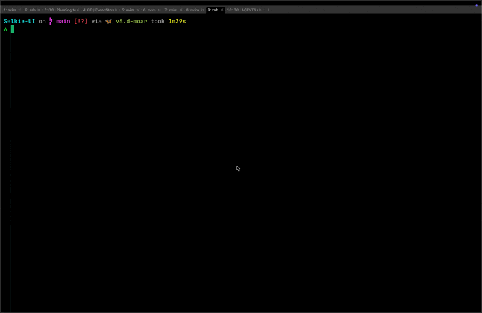
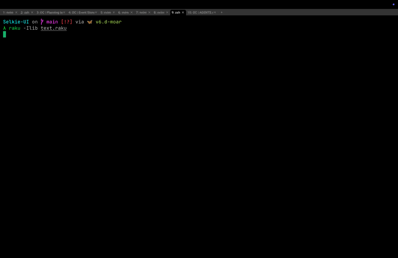
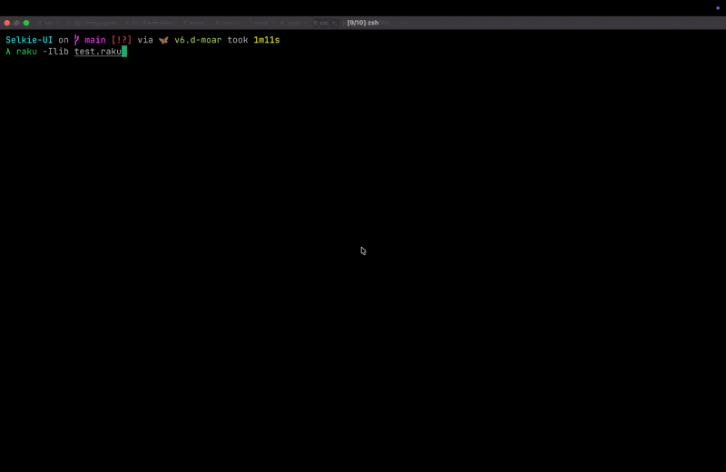

[](https://github.com/FCO/Selkie-UI/actions)

NAME
====

Selkie::UI

TITLE
=====

UI Builder Abstractions for Selkie

NOTE
====

This module is under active development. API may change.

SYNOPSIS
========


```raku
use Selkie::UI;

App {
    Screen :name<main>, {
        VBox {
            Button.label: "Click me"
        }
    }
}
```

DESCRIPTION
===========


Selkie::UI provides a Raku-native DSL for building terminal user interfaces using the [Selkie](https://raku.land/zef:apogee/Selkie) framework. Unlike traditional imperative UI code where you manually manage rendering and event loops, this module offers a declarative approach — your code describes **what** the UI should look like and do, not **how** to achieve it step-by-step.

Widgets are declared hierarchically using block syntax, with properties and handlers specified via chained method calls. This makes UI definitions intuitive, compositional, and easy to reason about — whether you are building simple tools or complex applications.

The DSL handles the glue between your declarative definitions and Selkie's imperative runtime, including state management with automatic UI updates when reactive variables change.

Dynamic Variables
=================

Builder context flows through dynamic variables. These are set by `App`, `Screen`, and layout containers, and are only available within their blocks:

  * `$*UI-APP` — The running application object (store, rendering, event loop)

  * `$*UI-PARENT` — The parent builder for tree hierarchy

  * `@*UI-PATHS` — Tracks state paths read during block evaluation (for auto-subscribe)

  * `@*UI-NODES` — Stack of child nodes being constructed

  * `$*UI-ID` — Unique string per auto-subscribe chain for event deduplication

State Management
================

new-state
---------

`new-state($default, :$name, :$event)` creates a reactive scalar state variable that automatically dispatches updates and re-renders affected UI elements. Returns a Proxy where reads track the state path in `@*UI-PATHS` and writes dispatch events through the store. Use for scalar values (Str, Int, Bool).

```raku
my $counter := new-state 0;
$counter = 42;
```

new-array-state
---------------

`new-array-state(@default, :$name, :$event)` returns a [ReactiveArray](ReactiveArray) object that implements `Positional` and `Iterable`. Bind with `:=` to an `@`-sigiled variable. Mutation methods (`ASSIGN-POS`, `push`, `pop`, `shift`, `unshift`, `splice`) dispatch fresh values to the store.

For nested mutations, use the extract-modify-reassign pattern:

```raku
my @tasks := new-array-state [{:title<A>,:!done},{:title<B>,:!done}];
my %task = @tasks[0];
%task<done> = True;
@tasks[0] = %task;   # ASSIGN-POS dispatches fresh Array
```

new-hash-state
--------------

`new-hash-state(%default, :$name, :$event)` returns a [ReactiveHash](ReactiveHash) object that implements `Associative` and `Iterable`. Bind with `:=` to a `%`-sigiled variable. Mutation methods (`ASSIGN-KEY`, `DELETE-KEY`) dispatch fresh values to the store.

```raku
my %config := new-hash-state {:theme<dark>, :refresh(30)};
%config<theme> = 'light';   # ASSIGN-KEY dispatches fresh Hash
```

Block-Based Setters
===================

Many builder methods accept a block instead of a literal value. When a block is provided, the builder:

  * Evaluates the block once to get the initial value

  * Tracks any `new-state` variables read inside the block via `@*UI-PATHS`

  * Subscribes to those state paths so the setter re-runs when states change

  * Updates the widget with the new value automatically

Example:

```raku
my $counter := new-state 0;
Text.text: { "Count: $counter" };
```

These reactive setters require an active `App` because auto-subscribe uses `$*UI-APP` and the store.

Builder Lifecycle
=================

  * `TWEAK` fires on construction, pushing the builder onto `@*UI-NODES` for parent capture

  * Parent iterates `@*UI-NODES` after the block to collect children

  * Chained method calls configure the underlying `.obj` widget

  * Block-valued setters trigger auto-subscribe for reactive updates

When building outside an `App` (e.g., in tests), use `Detached` to set up `@*UI-NODES`:

```raku
my $stream = Detached { TextStream };
```

Builders
========

The module exports builder functions for Selkie primitives. Each builder returns a chainable builder object that wraps the underlying widget.

Layout and Containers
---------------------

  * `App` — Application entry point that initializes the UI and starts the event loop

  * `Screen` — Named screens that can be switched between

  * `Tab` — Named screen for use inside `TabBar` (creates a Screen)

  * `VBox`, `HBox`, `Split` — Layout containers for stacking or splitting widgets

  * `Border`, `Modal`, `ScrollView` — Container and decorator widgets

  * `CardList` — Scrollable list of variable-height widgets

Inputs and Selection
--------------------

  * `Button` — Clickable button with label and press handler

  * `TextInput`, `MultiLineInput` — Text input fields with submit handling

  * `Checkbox`, `RadioGroup`, `Select` — Selection controls

  * `ProgressBar` — Progress indicator

Text and Lists
--------------

  * `Text`, `TextStream`, `RichText` — Text display widgets

  * `ListView`, `Table`, `TabBar` — List and table widgets

  * `Image`, `Spinner`, `Toast` — Media and status widgets

Overlays and Helpers
--------------------

  * `ConfirmModal` — Confirmation modal builder

  * `CommandPalette` — Fuzzy command launcher

  * `FileBrowser` — File picker modal

  * `HelpOverlay` — Contextual keybind help

  * `PasswordStrength` — Password strength meter

Charts
------

  * `Plot`, `BarChart`, `LineChart`, `ScatterPlot` — Chart widgets

  * `Sparkline`, `Heatmap`, `Histogram` — Inline and grid charts

  * `Axis`, `Legend` — Chart adornments

Helpers
=======

App helpers that interact with the runtime:

  * `Handler` — Register a store event handler

  * `Detached` — Create isolated UI nodes without parent attachment

  * `OnKey` — Register global key handlers

  * `OnFrame` — Register a per-frame callback

  * `Dispatch` — Dispatch events to the store

  * `Tick` — Tick the store immediately

  * `ShowModal` — Open a modal dialog

  * `CloseModal` — Close the currently open modal

  * `Focus` — Focus a specific widget (returns the widget for chaining)

  * `FocusNext` — Move focus to the next widget

  * `FocusPrevious` — Move focus to the previous widget

  * `SwitchScreen` — Switch to a named screen

  * `Quit` — Quit the application

  * `Toast` — Show a transient toast message

Playground
==========

There is a built-in playground to live-edit/test Selkie::UI code:

    raku -I lib bin/selkie-ui-playground.raku

[](./playground.gif)

Examples
========

Text input with reactive display
--------------------------------

This example creates a text input field that echoes user input to a text stream above it.

The program creates a reactive string variable with `new-state`, places a vertical box layout on screen, adds a text stream widget to display messages, and adds a text input widget. When the user types and presses Enter, the input text is stored in the reactive variable, which automatically updates the text stream, and the input field is cleared for the next entry.

```raku
use Selkie::UI;

App {
    my $next-msg := new-state Str;
    VBox {
        TextStream.append: { $next-msg };
        TextInput(:placeholder('Type here...')).size(1).on-submit: -> $input, $text {
            $next-msg = $text;
            $input.clear
        }
    }
}
```

The `App` block is the entry point that initializes the application. The `new-state` function creates a reactive state variable bound with `:=`, initialized as an empty string. The `VBox` widget arranges its children vertically from top to bottom. `TextStream.append` with a block argument reactively displays the value of `$next-msg` and updates whenever it changes. `TextInput` creates a single-line text input with a placeholder hint. `.size(1)` constrains the input to a fixed height of one row. `.on-submit` registers a handler that runs when the user presses Enter. The handler receives the input widget and the submitted text, stores the text in the reactive variable, and clears the input for the next entry.

[](./text.gif)

Button with reactive state
--------------------------

This example shows a button whose label changes based on a numeric state variable.

The program creates a reactive integer counter, places it in a vertical box, and displays a button. The button label is computed from the counter value using a block — when the counter changes, the label automatically re-renders. Each button press increments the counter, updating both the counter value and the button label.

```raku
use Selkie::UI;

App {
    my UInt $val := new-state 0;
    VBox {
        Button.label({ $val ?? "BLE $val" !! "BLA $val" })
            .on-press: { ++$val }
    }
}
```

[](./test.gif)

ListView with reactive items
----------------------------

This example binds a list view to a reactive array. When the array changes, the list updates automatically.

```raku
use Selkie::UI;

App {
    my $items := new-state <One Two Three>;
    VBox {
        ListView.set-items: { $items };
        Button.label('Refresh').on-press: {
            $items = <One Two Three Four>
        }
    }
}
```

TabBar with tabs
----------------

This example shows a TabBar with two tabs, each containing different content.

```raku
use Selkie::UI;

App {
    Screen :name<main>, {
        TabBar {
            my $content = Border;
            Tab { Text(:text('Dashboard')) }: :name<dash>, :label('Dashboard');
            Tab { Text(:text('Settings')) }:  :name<set>,  :label('Settings');
            $content
        }
    }
}
```

EXPORTS
=======

App and Screen
--------------

App(&block, |c)
---------------

Application entry point that initializes the UI and starts the event loop.

The block receives the builder as `$_` and runs inside the application context. All builder functions must be called inside an `App` block.

Screen(&block, Str :$name = "main", |c)
---------------------------------------

Named screens that can be switched between with `SwitchScreen`.

Screen($node, Str :$name = "main", |c)
--------------------------------------

Screen variant that accepts an existing widget node instead of a block.

Tab(&block, Str :$name!, Str :$label!, |c)
------------------------------------------

Named screen for use inside a `TabBar`. Returns a ScreenBuilder. The block receives the screen builder as `$_`.

```raku
Tab { Text(:text('Dashboard')) }: :name<dash>, :label('Dashboard');
```

Layout Containers
-----------------

VBox(&block, :$size, :$style, |c)
---------------------------------

Vertical box layout. Stacks children top-to-bottom.

HBox(&block, :$size, :$style, |c)
---------------------------------

Horizontal box layout. Stacks children left-to-right.

Split(&block?, :$ratio, :$size, :$style, |c)
--------------------------------------------

Split container. Divides space between children. Optional `:$ratio` sets the split proportion.

Inputs and Selection
--------------------

Button(:$label, :$size, :$style, |c)
------------------------------------

Pressable button with label. Supports `.on-press` handler (idempotent).

Methods:

  * `.label(Str)` / `.label(&block)` — Set or reactively bind label text

  * `.on-press(&block)` — Register click handler (idempotent)

TextInput(:$placeholder, :$size, :$style, |c)
---------------------------------------------

Single-line text input field.

Methods:

  * `.text(Str)` / `.text(&block)` — Get/set text

  * `.text-silent(Str)` — Set text without triggering events

  * `.on-submit(&block)` — Submit handler (idempotent)

  * `.on-change(&block)` — Change handler (idempotent)

  * `.clear` / `.clear(&block)` — Clear input

  * `.mask(:$char!)` — Set mask character for password input

MultiLineInput(:$placeholder, :$max-lines, :$size, :$style, |c)
---------------------------------------------------------------

Multi-line text input area.

Checkbox(:$label, :$size, :$style, |c)
--------------------------------------

Toggleable checkbox with label.

Methods:

  * `.label(Str)` / `.label(&block)` — Set or reactively bind label

  * `.check(Bool)` / `.check(&block)` — Set checked state

  * `.on-change(&block)` — Change handler (idempotent)

RadioGroup(:$size, :$style, |c)
-------------------------------

Group of radio buttons for exclusive selection.

Select(:$size, :$style, |c)
---------------------------

Dropdown-style selection widget.

PasswordStrength(:$input!, :$show-label, :$size, :$style, |c)
-------------------------------------------------------------

Password input with strength meter visualization.

Text and Rich Content
---------------------

Text(&block?, :$text, :$size, :$style, |c)
------------------------------------------

Static text display widget. The optional block variant supports reactive subscriptions when used inside `App`.

Methods:

  * `.text(Str)` / `.text(&block)` — Set or reactively bind text

  * `.text-silent(Str)` — Set text without triggering events

TextStream(:$placeholder, :$size, :$style, |c)
----------------------------------------------

Scrollable text stream for streaming log-like content.

Methods:

  * `.append(Str)` / `.append(&block)` — Append text (block = reactive)

  * `.clear(Bool)` / `.clear(&block)` — Clear the stream

  * `.max-lines(UInt)` — Limit visible lines

RichText(:$truncated-top, :$truncated-bottom, :$size, :$style, |c)
------------------------------------------------------------------

Rich text widget with styled spans.

Lists and Tables
----------------

ListView(&block?, :$size, :$style, |c)
--------------------------------------

Scrollable list of items. Supports `.set-items` for reactive data.

Methods:

  * `.set-items(@items)` / `.set-items(&block)` — Set list items

  * `.on-select(&block)` — Selection handler (idempotent)

  * `.on-activate(&block)` — Activation handler (idempotent)

  * `.on-key(Str $key, &block)` — Key handler (idempotent)

  * `.cursor` — Current cursor position

Table(&block?, :$show-scrollbar, :$size, :$style, |c)
-----------------------------------------------------

Tabular data display with column headers. Accepts columns as array of hashes with `:name`, `:label`, `:sizing`/`:flex`/`:fixed`, `:sortable`, `:render`, and `:sort-key`. The optional block sets row data reactively.

Methods:

  * `.add-column(:$name!, :$label!, ...)` — Add a column

  * `.rows(@rows)` / `.rows(&block)` — Set or reactively bind rows

  * `.clear-columns` — Remove all columns

  * `.on-select(&block)` — Selection handler (idempotent)

  * `.on-activate(&block)` — Activation handler (idempotent)

  * `.on-key(Str $key, &block)` — Key handler

CardList(&block?, :$select-first, :$select-last, :$size, :$style, |c)
---------------------------------------------------------------------

Scrollable list of variable-height widget cards. Each item is a widget with a required height. Supports reactive data via block setters.

Methods:

  * `.add-item($widget, :$height!, :$root, :$border)` — Add a card

  * `.set-items(@items)` / `.set-items(&block)` — Replace all items

  * `.clear-items` — Remove all items

  * `.set-item-height(Int $idx, Int $height)` — Change item height

  * `.select-index(Int $idx)` — Select item by index

  * `.select-first(Bool)` / `.select-last(Bool)` — Select first/last

  * `.scroll-up` / `.scroll-down` — Scroll by one item

  * `.on-select(&block)` — Selection handler (idempotent)

TabBar(&block?, :$active-tab, :$size, :$style, |c)
--------------------------------------------------

Tabbed navigation bar. Uses a declarative block-based API. The block must return a content container (e.g., Border) that provides `.title` and `.content` methods. Use `Tab` inside the block to define screens.

```raku
TabBar {
    my $content = Border;
    Tab { Text(:text('Dashboard')) }: :name<dash>, :label('Dashboard');
    Tab { Text(:text('Settings')) }:  :name<set>,  :label('Settings');
    $content
}
```

Methods:

  * `.add-tab(:$name!, :$label!)` — Register a tab

  * `.remove-tab(Str $name)` — Remove a tab

  * `.clear-tabs` — Remove all tabs

  * `.select-by-name(Str $name)` — Select tab by name

  * `.select-index(UInt $idx)` — Select tab by index

  * `.on-tab-selected(&block)` — Tab change handler (idempotent)

Overlays and Helpers
--------------------

Border(&block?, :$title, :$hide-top-border, :$hide-bottom-border, :$size, :$style, |c)
--------------------------------------------------------------------------------------

Bordered container with optional title. Supports reactive title via block.

Modal(Selkie::UI::Base $widget)
-------------------------------

Extracts the `.modal` widget from an existing builder. Useful with `ShowModal`.

Modal(&block?, :$width-ratio, :$height-ratio, :$dim-background, :$size, :$style, |c)
------------------------------------------------------------------------------------

Modal overlay dialog with configurable size and backdrop dimming.

ConfirmModal(:$title, :$message, :$yes-label, :$no-label, :$width-ratio, :$height-ratio, :on-result, |c)
--------------------------------------------------------------------------------------------------------

Confirmation dialog with accept/cancel buttons.

Toast(Str $message, Numeric :$duration = 3e0)
---------------------------------------------

Temporary toast notification dispatched via the app.

HelpOverlay(:$app!, :$focused-widget, :$size, :$style, |c)
----------------------------------------------------------

Keyboard shortcut help overlay.

CommandPalette(&block?, :$size, :$style, |c)
--------------------------------------------

Command palette for fuzzy-searchable actions. The optional block registers commands.

Methods:

  * `.add-command(&action, :$label!)` — Register a command

  * `.commands(@pairs)` — Set commands from pairs

  * `.show-modal` — Show the palette modal

  * `.on-command(&block)` — Command handler (idempotent)

  * `.build` — Build the underlying modal widget

FileBrowser(&block?, Bool :$show-modal, Bool :$focus, :&on-select, :$size, :$style, |c)
---------------------------------------------------------------------------------------

File system browser widget that opens as a modal.

Miscellaneous
-------------

ScrollView(&block?, :$show-scrollbar, :$size, :$style, |c)
----------------------------------------------------------

Scrollable viewport container for overflowing content.

Spinner(:@frames, :$interval, :$style, :$size, |c)
--------------------------------------------------

Animated spinner with configurable frames and interval.

Methods:

  * `.tick` — Advance to next frame

  * `.reset` — Reset to first frame

Image(&block?, :$file, :$size, :$style, |c)
-------------------------------------------

Image display widget. Supports reactive file binding via block.

ProgressBar(:$size, :$style, |c)
--------------------------------

Progress bar with configurable value.

Methods:

  * `.progress(Numeric)` / `.progress(&block)` — Set progress value

  * `.indeterminate(Bool)` — Toggle indeterminate mode

  * `.show-percentage(Bool)` — Toggle percentage display

  * `.tick` — Advance animation frame

Charts
------

Plot(:$type, :$min-y, :$max-y, :$title, :$gridtype, :$rangex, :@store-path, :$empty-message, :$size, :$style, |c)
-----------------------------------------------------------------------------------------------------------------

General-purpose plot widget.

BarChart(:@data, :@store-path, :$orientation, :$palette, :$show-axis, :$show-labels, :$min, :$max, :$tick-count, :$empty-message, :$size, :$style, |c)
------------------------------------------------------------------------------------------------------------------------------------------------------

Bar chart with configurable orientation and styling.

LineChart(:@series, :&store-path-fn, :$palette, :$show-axis, :$show-legend, :$fill-below, :$overlap, :$y-min, :$y-max, :$tick-count, :$empty-message, :$size, :$style, |c)
--------------------------------------------------------------------------------------------------------------------------------------------------------------------------

Line chart with multiple series support.

ScatterPlot(:@series, :@store-path, :$palette, :$x-min, :$x-max, :$y-min, :$y-max, :$overlap, :$empty-message, :$size, :$style, |c)
-----------------------------------------------------------------------------------------------------------------------------------

Scatter plot for point data visualization.

Sparkline(:@data, :@store-path, :$min, :$max, :$empty-message, :$size, :$style, |c)
-----------------------------------------------------------------------------------

Compact inline sparkline chart.

Heatmap(:@data, :@store-path, :$ramp, :$min, :$max, :$empty-message, :$size, :$style, |c)
-----------------------------------------------------------------------------------------

Heatmap for matrix data visualization.

Histogram(:@values, :$bins, :@bin-edges, :$orientation, :$palette, :$show-axis, :$show-labels, :$min, :$max, :$tick-count, :$empty-message, :$size, :$style, |c)
----------------------------------------------------------------------------------------------------------------------------------------------------------------

Histogram for distribution visualization.

Axis(:$min!, :$max!, :$edge, :$tick-count, :$show-line, :$size, :$style, |c)
----------------------------------------------------------------------------

Chart axis with configurable range and ticks.

Legend(:@series, :$orientation, :$swatch, :$size, :$style, |c)
--------------------------------------------------------------

Chart legend for multi-series plots.

State and Helpers
-----------------

new-state($default, :$name, :$event)
------------------------------------

Creates a reactive state variable. Returns a Proxy that auto-tracks reads and dispatches events on writes. Use for scalar values (Str, Int, Bool). Requires an active `App` context.

new-array-state(@default, :$name, :$event)
------------------------------------------

Creates a reactive array state. Returns a `ReactiveArray` that implements `Positional` and `Iterable`. Bind with `:=` to an `@`-sigiled variable. Mutations dispatch fresh values: `push`, `pop`, `shift`, `unshift`, `splice`, `ASSIGN-POS`.

new-hash-state(%default, :$name, :$event)
-----------------------------------------

Creates a reactive hash state. Returns a `ReactiveHash` that implements `Associative` and `Iterable`. Bind with `:=` to a `%`-sigiled variable. Mutations dispatch fresh values: `ASSIGN-KEY`, `DELETE-KEY`.

Handler(Str $name, &block)
--------------------------

Registers a store event handler for the given event name.

Detached(&block)
----------------

Creates isolated UI node contexts without parent attachment. Sets up `@*UI-NODES` for the block. Returns the block's result if defined, otherwise the first child node from `@*UI-NODES`.

```raku
my $stream = Detached { TextStream };
```

OnKey(Str:D $spec, &handler, Str :$screen)
------------------------------------------

Registers a keypress handler. `$spec` is a key specification string (e.g., `"ctrl+p"`, `"q"`, `"tab"`).

OnFrame(&block)
---------------

Registers a per-frame callback for animation or polling.

Dispatch($event, *%payload)
---------------------------

Dispatches a named event through the store with optional payload.

Tick
----

Triggers an immediate store tick (re-render cycle).

ShowModal($modal)
-----------------

Opens a modal dialog from a builder or widget. Returns the modal widget.

CloseModal
----------

Closes the currently open modal dialog.

Focus($widget)
--------------

Focuses a specific widget. Returns the widget for chaining. Handles `.focusable-widget` delegation automatically.

FocusNext
---------

Moves focus to the next focusable widget.

FocusPrevious
-------------

Moves focus to the previous focusable widget.

SwitchScreen(Str $name)
-----------------------

Switches to a named screen.

Quit
----

Exits the TUI application gracefully.

Toast(Str $message, Numeric :$duration = 3.0)
---------------------------------------------

Dispatches a transient toast notification via the app.

AUTHOR
======

Fernando Correa de Oliveira

LICENSE
=======

Artistic-2.0

